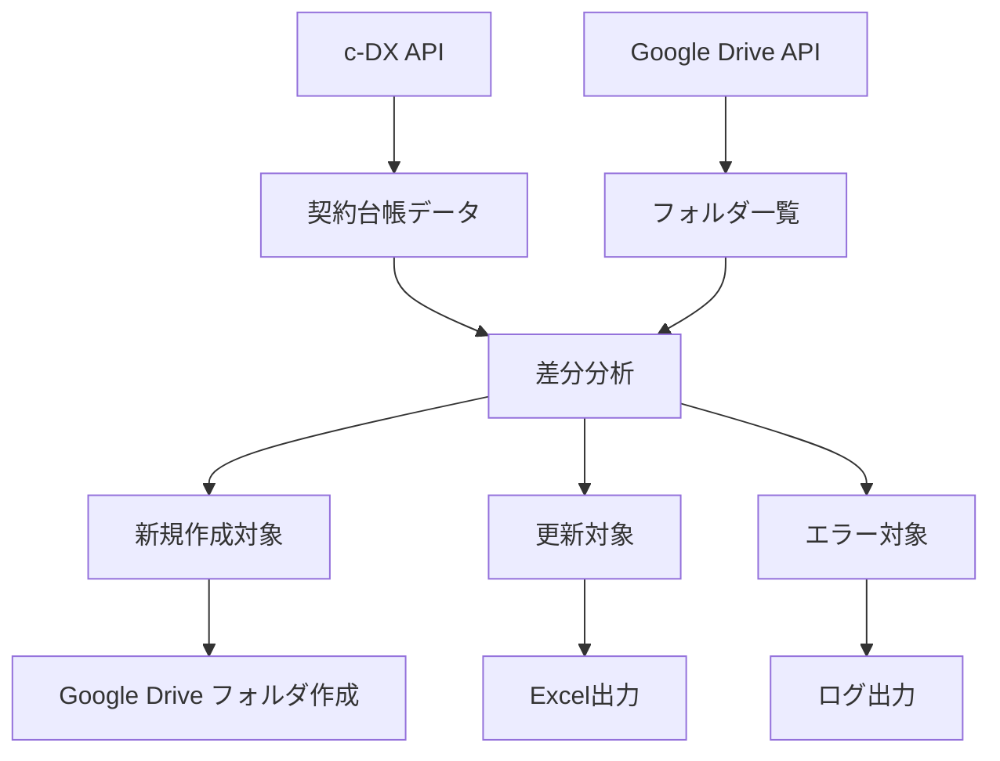
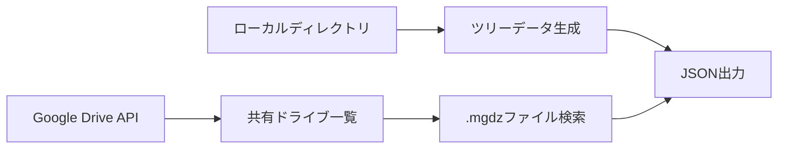

# cmDirSettings プロジェクト全体フロー図

## プロジェクト概要

このプロジェクトは、建設業界向けのディレクトリ管理システムで、以下の主要機能を持っています：

1. **ARCHITREND**: 引渡済み案件のディレクトリ管理
2. **ARCHITRENDdaily**: 日次ディレクトリリスト生成
3. **cmDir**: Google Drive 連携による顧客フォルダ管理
4. **GDriveThumbsCleaner**: Google Drive の Thumbs.db ファイル削除

## システム全体フロー図

```mermaid
graph TB
    subgraph "メインシステム"
        A[プロジェクト開始] --> B{機能選択}

        B -->|ARCHITREND| C[引渡済み案件管理]
        B -->|ARCHITRENDdaily| D[日次ディレクトリリスト]
        B -->|cmDir| E[Google Drive顧客フォルダ管理]
        B -->|GDriveThumbsCleaner| F[Thumbs.db削除]
    end

    subgraph "ARCHITREND機能"
        C --> C1[checkDeliveredDir.ts]
        C --> C2[RecycleClean.ts]

        C1 --> C1A[Z:/ATDATA スキャン]
        C1A --> C1B[引渡済(3年内)フォルダ抽出]
        C1B --> C1C[CSV出力: workspaceOutput.csv]

        C2 --> C2A[Z:/ATDATA スキャン]
        C2A --> C2B[$Recycle フォルダ検索]
        C2B --> C2C[並列削除処理]
    end

    subgraph "ARCHITRENDdaily機能"
        D --> D1[ARCHITRENDdirList.ts]
        D1 --> D2[googleWorkspace.ts]

        D1 --> D1A[ローカルディレクトリスキャン]
        D1A --> D1B[ツリーデータ生成]

        D2 --> D2A[Google Drive API接続]
        D2A --> D2B[共有ドライブ一覧取得]
        D2B --> D2C[.mgdzファイル検索]
        D2C --> D2D[JSON出力: customerDirList.json]
    end

    subgraph "cmDir機能"
        E --> E1[GDriveCreateCmDir]
        E1 --> E2[main.ts]

        E2 --> E2A[get_DX.ts]
        E2 --> E2B[get_GDrive.ts]
        E2 --> E2C[diff.ts]
        E2 --> E2D[create_And_update.ts]

        E2A --> E2A1[c-DX API接続]
        E2A1 --> E2A2[契約台帳データ取得]
        E2A2 --> E2A3[引渡済み顧客リスト]

        E2B --> E2B1[Google Drive API接続]
        E2B1 --> E2B2[年フォルダ一覧取得]
        E2B2 --> E2B3[顧客フォルダ一覧取得]

        E2C --> E2C1[差分分析]
        E2C1 --> E2C2[not_registered_in_c_DX]
        E2C1 --> E2C3[not_exist_in_GDrive]
        E2C1 --> E2C4[not_match_customerNumber]
        E2C1 --> E2C5[not_exist_in_c_DX]

        E2D --> E2D1[新規フォルダ作成]
        E2D1 --> E2D2[Excel出力: GDriveUpdateSheet.xlsx]
    end

    subgraph "GDriveThumbsCleaner機能"
        F --> F1[ThumbsCleaner.ts]
        F1 --> F1A[Google Drive API接続]
        F1A --> F1B[Thumbs.dbファイル検索]
        F1B --> F1C[ゴミ箱に移動]
        F1C --> F1D[500件制限]
    end

    subgraph "共通リソース"
        R1[copy_const.ts]
        R2[copy_GCP_API.ts]
        R3[copy_axios_DX_API.ts]
        R4[types_DX.ts]

        R1 --> R1A[環境変数管理]
        R1 --> R1B[タイマー機能]
        R1 --> R1C[パス設定]

        R2 --> R2A[Google API認証]
        R2 --> R2B[Drive/Sheets API]

        R3 --> R3A[c-DX API認証]
        R3 --> R3B[トークン管理]
        R3 --> R3C[エラーハンドリング]
    end

    %% 依存関係
    C1 -.-> R1
    C2 -.-> R1
    D1 -.-> R1
    D2 -.-> R2
    E2A -.-> R3
    E2B -.-> R2
    F1 -.-> R2
```

## データフロー詳細

### ARCHITREND データフロー

```mermaid
flowchart LR
    A[Z:/ATDATA] --> B[引渡済(3年内)フォルダ]
    B --> C[年フォルダ]
    C --> D[顧客フォルダ]
    D --> E[CSV出力]

    A --> F[$Recycle フォルダ]
    F --> G[並列削除]
```

### cmDir データフロー



### ARCHITRENDdaily データフロー



## 技術スタック

-   **言語**: TypeScript
-   **実行環境**: Node.js
-   **API**:
    -   Google Drive API
    -   c-DX API (カスタム)
-   **認証**:
    -   Google Service Account
    -   c-DX Token 認証
-   **ファイル形式**:
    -   CSV (Shift-JIS)
    -   JSON
    -   Excel (.xlsx)

## 環境設定

-   **開発環境**: Windows 11
-   **本番環境**: Windows Server
-   **パス設定**:
    -   開発: X:/code
    -   本番: E:/Administration/code
-   **データディレクトリ**:
    -   Z:/ATDATA (開発)
    -   E:/share/ATDATA (本番)
